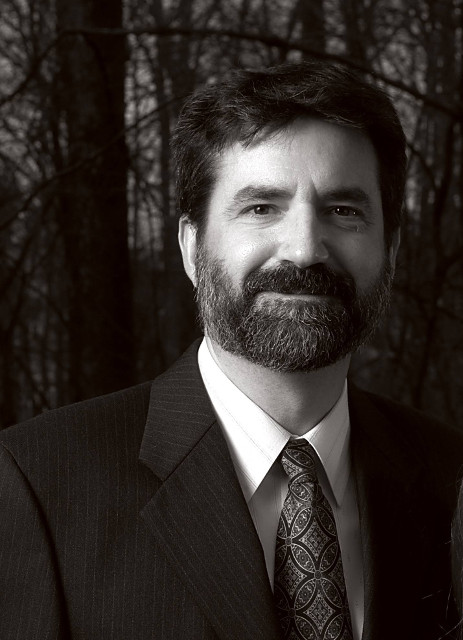
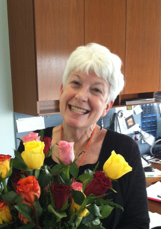

# Rides to and from NCSSM and Immaculate Conception Catholic Church

The community of Durham's [Immaculate Conception Catholic Church](http://icdurham.org/) have long enjoyed the 
presence of NCSSM students at our weekend Masses. We will continue to work to provide rides for you between
Immaculate Conception and the NCSSM campus.

* We meet in Bryan lobby prior to Mass for pick-up.
* See the sign-up sheet for the meeting time as it will vary based on what Mass you are attending
* After Mass we all meet back together again in the Church's gathering space, near the main entrance doors, for the return trip to campus.

Please sign-up using the links below so that we know to expect you. Check this page each week for updates to the sign-up forms.

|First Weekend        |Second Weekend |Third Weekend              |Fourth Weekend|Holy Days/Other        |
|--------------------:|--------------:|--------------------------:|-------------:|----------------------:|
|August    12         |August    18/19|August    25/26            |              |                       |
|September  8/9       |September 15/16|September 22/23            |              |                       |
|October    6/7       |October   13/14|October   20/21            |October 27/28 |                       |
|November  10/11      |               |                           |              |                       |
|December   1/2       |December   8/9 |December  15/16            |              |                       |
|January   12/13      |January   19/20|                           |              |                       |
|February   2/3       |February   9/10|February  23/24 (Mini-Term)|              |                       |
|March      2/3       |March      9/10|March     16/17            |March   30/31 |March 6 (Ash Wednesday)|
|April      6/7 (Prom)|April     13/14|                           |              |                       |
|May        4/5       |May       11/12|May       18/19            |              |                       |

On behalf of Immaculate Conception, *Welcome to Durham*, and we look forward to meeting each of you this year,

Daniel Schudel

[dan.schudel@gmail.com](mailto:dan.schudel@gmail.com)

## This Year's Drivers

### Daniel

Look for me in Bryan Lobby on Sunday mornings. I'll be coordinating the rides with individual drivers.

### Kathy

Kathy often drives for the Saturday 5:30 Mass.

