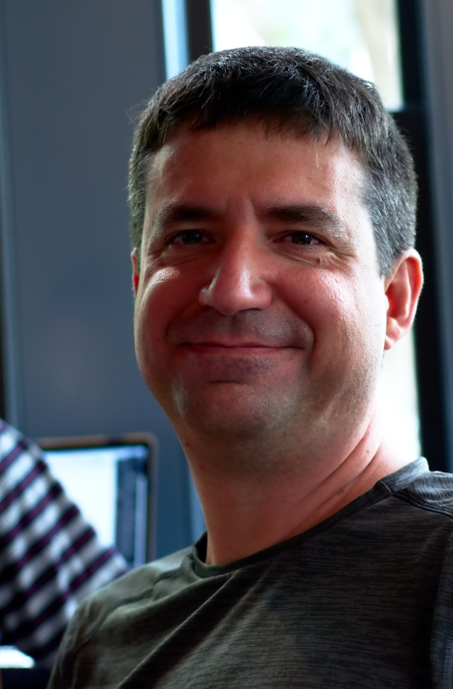

# Rides to and from NCSSM and Immaculate Conception Catholic Church

The community of Durham's [Immaculate Conception Catholic Church](http://icdurham.org/) has long enjoyed the 
presence of NCSSM students at our weekend Masses. We will continue to work to provide rides for you between
Immaculate Conception and the NCSSM campus.

* We meet in Bryan lobby prior to Mass for pick-up.
* See the sign-up sheet for the meeting time as it will vary based on what Mass you are attending
* After Mass we all meet back together again in the Church's gathering space, near the main entrance doors, for the return trip to campus.

Please sign-up using the day's link in the table below so that we know to expect you that weekend.

Check this page ([https://danielschudel.github.io/NCSSM-ICD/](https://danielschudel.github.io/NCSSM-ICD/))
each week for new sign-up links.

|First Weekend      |Second Weekend |Third Weekend            |Fourth Weekend  |Holy Days/Other         |
|------------------:|--------------:|------------------------:|---------------:|-----------------------:|
|Aug  11            |Aug 18         |Aug 25                   |                |                        |
|Sept  8            |Sept 15        |Sept 22                  |                |                        |
|Oct   5/6          |~~Oct  13~~    |Oct  20                  |Oct 27          |                        |
|Nov  10            |Nov  17        |                         |                |                        |
|Dec   8            |Dec  15        |                         |                |                        |
|Jan  12            |Jan  19        |                         |                |                        |
|Feb   2            |Feb   9        |                         |                |                        |
|Mar   1            |[Mar   8](https://www.signupgenius.com/go/10c0b4cafa82ba13-march17)        |Mar  22                  |Mar     29      |                        |
|Apr   5 (Prom)     |Apr  26        |                         |                |                        |
|May   3            |May  10        |May  17                  |                |                        |

On behalf of Immaculate Conception, *Welcome to Durham*, and we look forward to meeting each of you this year,

Daniel Schudel

[dan.schudel@gmail.com](mailto:dan.schudel@gmail.com)

## This Year's Drivers

### Daniel

Look for me in Bryan Lobby on Sunday mornings. I'll be coordinating the rides with individual drivers.

